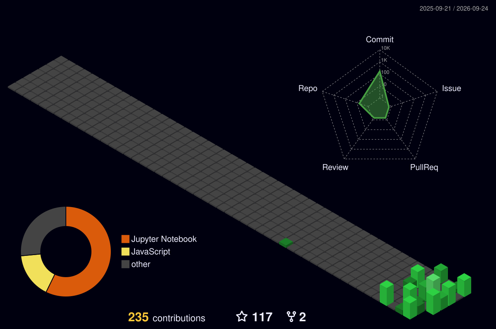

<div align="center">

<!-- Hi There, I'm Tony White 👋 -->


<!-- Roles Typing Animation -->
<a href="https://github.com/itstonywhite">
  
</a>

<!-- Roles -->
### `Full-Stack Developer` · `Software Engineer` · `AI/ML Engineer in Progress`

<!-- GitHub Info -->
<p>
    
  
  
  <!--  -->
</p>

<!-- Socials -->
<p>
    
  <a href="https://x.com/itstonywhite_">
    
  </a>
  <a href="mailto:itsthetonywhite@gmail.com">
    
  </a>
</p>

<!-- Quote -->
> **I build software, study the mathematics behind intelligent systems, and turn ideas into real products.**

</div>

---

## 🧑🏻‍💻 About Me

I'm Tony — 17-year-old focused on building across the full software stack while moving deeper into **Machine Learning and AI Engineering**.
I enjoy understanding how things work underneath and build them myself.

```text
┌──────────────────────────────────────────────────────────────────────┐
│  IDEAS --> BUILD --> UNDERSTAND --> LEARN --> EXPERIMENT --> SHIP    │
└──────────────────────────────────────────────────────────────────────┘
```

### 🧠 What I do

- 🖥️ Build modern **web applications**
- ⚙️ Design software systems and developer workflows
- 💪 Learn web technologies
- 🤖 Study **machine learning, deep learning & AI engineering**
- 📐 Strengthen the **mathematics** behind ML and intelligent systems
- 🧪 Learn by building projects, experimenting, researching and solving problems
- 🚀 Explore ideas that could eventually become **real products** and **solves problems**

---

## 🧰 Tech Stack

### 💻 Languages & Core

<p align="center">
  
</p>

### 🌐 Frontend

<p align="center">
  
</p>

### ⚙️ Backend & Data

<p align="center">
  
</p>

### 🤖 AI / ML / Scientific Computing

<p align="center">
  
  <div align="center">
    
    
    
    
    
    
    
    
  </div>
</p>

### 🛠️ Tools & Platform

<p align="center">
  
</p>

<p align="center">
  
  
  
  
  
</p>

---

## 📚 Currently Learning

```text
                  CURRENT LEARNING PATH
                            │
            ┌───────────────┼────────────────┐
            ▼               ▼                ▼
       Mathematics      Software          AI & ML
            │          Engineering           │
            │               │                │
     ┌──────┴───────┐  ┌────┴───────┐  ┌─────┴───────┐
     │ Calculus     │  │ TypeScript │  │ ML          │
     │ Linear Alg   │  │ Next.js    │  │ Deep Learn  │
     │ Probability  │  │ Node.js    │  │ PyTorch     │
     │ Statistics   │  │ Databases  │  │ CV, NLP     │
     │ Optimization │  │ APIs       │  │ LLMs, Agent │
     └──────────────┘  └────────────┘  └─────────────┘
```

### 🧮 Mathematics

- Linear Algebra
- Calculus
- Probability
- Statistics
- Optimization

### 🧠 AI / ML

- Machine Learning
- Neural Networks
- Deep Learning
- Computer Vision
- Natural Language Processing
- Large Language Models
- RAG Systems
- AI Agents
- MCP (Model Contex Protocol)

### 🚀 Software & Product Engineering

- TypeScript
- React
- Redux
- Next.js
- Web Socket
- Node.js
- Express.js
- Nest.js
- MongoDB
- MySQL
- PostgreSQL
- Docker
- Webpack
- Cloud & deployment workflows

---

## 📊 GitHub Analytics

<div align="center">
  
</div>

---

## 🌃 Contribution Graph

<div align="center">



</div>

---

## 💡 Interests

<p align="center">

`Artificial Intelligence` · `Machine Learning` · `Deep Learning` · `Computer Vision`  
`Software Engineering` · `Web Development` · `Robotics` · `Mathematics`  
`Developer Tools` · `Automation` · `Startups` · `Product Building`

</p>

---

## 📫 Connect

<p align="center">
  <a href="https://github.com/itstonywhite">
    
  </a>
  <a href="https://x.com/itstonywhite_">
    
  </a>
</p>

<br/>

<div align="center">

### `Code. Learn. Build. Repeat. 🚀`

<br/>


</div>
